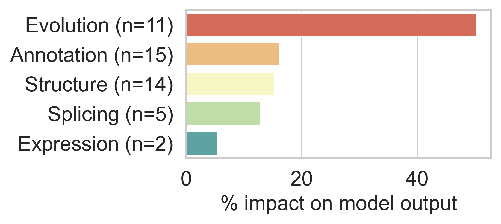

---
# Basics
title: 'TRIFID: determining functional isoforms'
author:
  - name: Fernando Pozo Ocampo
    affil: 1
    orcid: '0000-0001-7688-6045'
  - name: Laura Martínez-Gómez
    affil: 1
  - name: Michael L. Tress
    affil: 1
affiliation:
  - num: 1
    address: Bioinformatics Unit, Spanish National Cancer Research Center (CNIO)
poster_width: 48in
poster_height: 36in
font_family: 'Open Sans'
titletext_fontfamily: 'Open Sans'

# Main Colour Scheme
primary_colour: '#335c67' 
secondary_colour: '#332A38' 
accent_colour: '#3540b0e04D6D' 

# Further Customization
# Title Box
titlebox_bordercol:	"#0b4545"	# Colour of the title box border.
title_textsize: "165px" # Poster title fontsize.
titlebox_borderwidth:	"0in"	# Width of the title box border.
title_textcol:	"#ffffff"	# Colour of title text
author_textcol:	"#ffffff"	# Colour of author text.
author_textsize:	"60px"	# Author list font size.
affiliation_textsize:	"30px"	# Affiliation font size.
affiliation_textcol:	"#ffffff"	# Affiliation font size.
logoleft_name:	"img/bu.png"	# Location of the image to use.
logoright_name:	"img/gencode.png"

# Poster Body
body_bgcol: "#ffffff"	 # Colour of the poster main background.
body_textsize: "51px" # Size of the main poster body text.
body_textcol:	"#000000"	# Colour of main text in the body of poster.
column_numbers:	3	# Number of columns that the poster body has.
column_margins:	"0.5in"	# Margin spacing for columns.
columnline_col:	"#d7d8db"	# Colour of the column line dividers.
columnline_width:	"2mm"	# Width of line between each column.
columnline_style:	'solid'	# Style of the column line seperator.
sectitle_textcol:	"#ffffff"	# Colour of the poster section titles.
sectitle_textsize:	"100px"	# Text size of the section titles (H1).
sectitle2_textsize:	"40pt"	# Text size of the section titles (H2).
sectitle_bgcol:	"#335c67"	# Colour of the section title box.
sectitle_bordercol:	"#ffffff"	# Colour of the border around the section title box.
sectitle_borderwidth:	"2mm"	# Thicknes of the section title box border.
sectitle_boxshape:	"4mm 1mm"	# Changes the shape of the section title box.
sectitle2_textcol:	"#8d99ae"	# Color of 2nd level header text.
reference_textsize: "20px"
link_col:	"#0b4545"	# Colour of other links within the poster.

output: 
  posterdown::posterdown_html:
    self_contained: false
    fig_caption: yes
    number_sections: false

---
<style>
p.caption {
  font-size: 0.80em;
}
</style>

```{r setup, include=FALSE}
knitr::opts_chunk$set(echo = FALSE)
```

# Introduction
## Background

Alternative Splicing (AS) of messenger RNA can generate a wide variety of mature RNA transcripts and this expression is confirmed by experimental transcript evidence. However, it is not clear how many alternative transcripts will code for functional proteins. ([Tress et al. 2017](), [Blencowe et al. 2017]()).
 
Proteomics analyses have shown that most coding genes have a single main splice isoform ([Ezkurdia et al. 2015]()).

Human population variation data indicate that most AS transcripts are evolving neutrally ([Tress et al. 2017]()).

Ever more splice isoforms are annotated every day, but we do not know their function.

## Objectives

<div style="text-align: left; font-size: 110%; font-weight: bold;", markdown = "1">
Grading what proportion of AS is functional.
<br><br>
Developing a machine learning based tool for predicting splice isoform functional importance.
</div>


# Methods

`TRIFID` (Tool to Reliable Identification of Functional Isoform Data) is a Random Forest based **predictor of the relative functional importance of splice isoforms**.

It has been trained on reliable peptide evidence from 497 genes from the largest tissue-based proteomics analysis to date (79 experiments) and 47 features categorized in 5 groups (*genome annotation*, *structural*, *splicing impact*, *cross-species conservation* and *RNA-seq expression*).

Development code available [here](https://gitlab.com/bu_cnio/trifid).

<div>
<br>
</div>

# Results
## SHAP feature importances and model interpretation
```{r figure1-pkgdown, out.width="90%", fig.cap='SHAP values ([Lundberg et al. 2020](https://www.nature.com/articles/s42256-019-0138-9)) added by category. Features that best distinguish functional isoforms in the training set are conservation-based. Other important features include the length difference between the alternative isoform and the longest isoform, whether or not the transcript has a CCDS ([Pruitt et al. 2009](https://www.ncbi.nlm.nih.gov/pmc/articles/PMC2704439/)), and the conservation of Pfam functional domains. The SHAP scores can also provide clues to the influence of features on individual predictions (see example: [Fibroblast growth factor receptor 1](https://www.ensembl.org/Homo_sapiens/Gene/Summary?g=ENSG00000077782;r=8:38400215-38468834) ([TRIFID Scores](https://gitlab.com/bu_cnio/trifid#example-fibroblast-growth-factor-receptor-1-fgfr1))'}

```

## Functional importance in the human genome

````{r figure2-pkgdown, out.width="100%", fig.cap='Non-redundant isoforms divided into PRINCIPAL or ALTERNATIVE according to their annotation in APPRIS ([Rodriguez et al. 2017](https://academic.oup.com/nar/article/46/D1/D213/4561658)). Most AS isoforms have TRIFID scores below 0.05. Most PRINCIPAL isoforms have predictor scores above 0.9.'}
knitr::include_graphics("img/figure2.png")
```

<div style="text-align: center; font-size: 65%; font-style: italic;", markdown = "1">
<br>
<br>
<br>
This work has been funded by the US National Institutes of Health grant 2 U41 HG007234.
<br>
</div>

## Validating the model against an external source of information

```{r figure3-pkgdown, out.width="90%", fig.cap='Non-synonymous to synonymous (NS/Syn) ratios for alternative exons (exons that are exclusively present in alternative isoforms). Exons under selective pressure should have significantly lower NS/Syn ratios for common than for rare allele frequencies. The vast majority of alternative exons are not under selective pressure.'}
knitr::include_graphics("img/figure3.png")
```

# Conclusions

`TRIFID` discriminates functionally important isoforms with high confidence (MCC=0.89, AUPRC=0.98 over 5-folds CV of the training set). Thanks to TRIFID, we can now list the most biologically relevant alternative isoforms. Our model can be successfully exported to different genome species and genome annotation databases.

`TRIFID` predicts that a large majority of splice variants (85-90%) in the human genome are likely to not be functionally important at the protein level.

NS/Syn ratios from show that exons from the highest scoring of alternative transcripts are under selective pressure, while low scoring exons have little or no evidence of selection.

<!-- # Acknowledgements

. -->